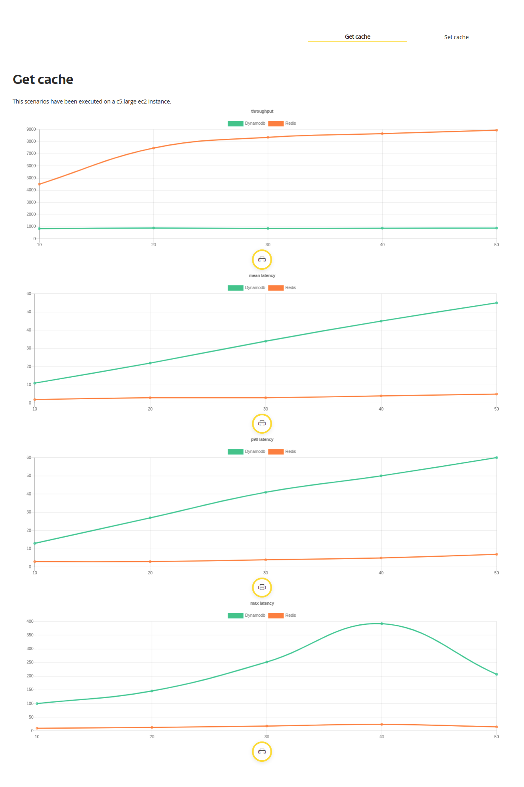
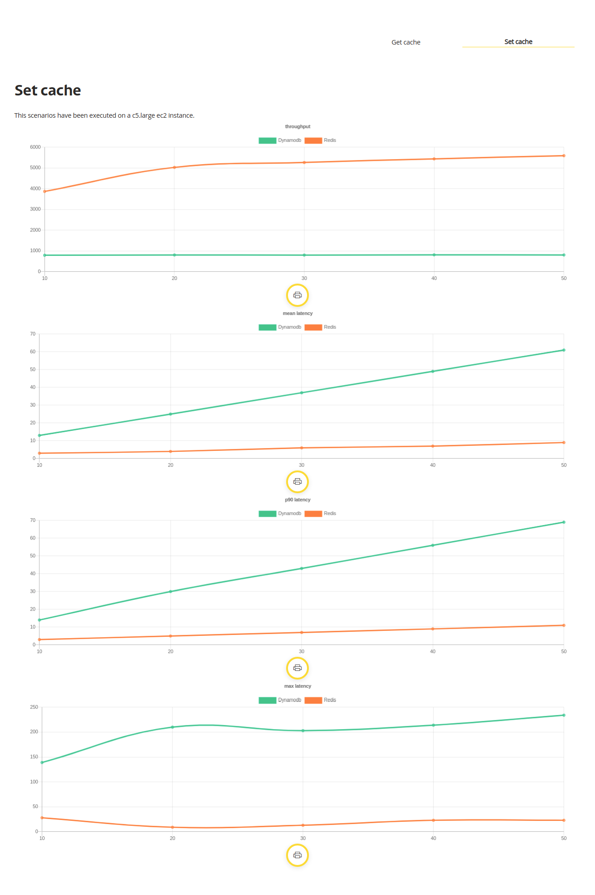

# MsBenchmarkCache

### Configuración de la prueba

- Pruebas realizada con: [Performance Analyzer](https://github.com/bancolombia/distributed-performance-analyzer).  
```
execution: %{
 steps: 5,
 increment: 10,
 duration: 5000,
 constant_load: false
}
```

### Configuración Dynamodb

(Unidades de capacidad aprovisionadas)
- Capacidad de lectura: 90 
- Capacidad de escritura: 90

Nota: Usar una configuración menor en unidades de aprovisionamiento genera la siguiente excepción:
```
{:error, {"ProvisionedThroughputExceededException", "The level of configured provisioned throughput for the table was exceeded. Consider increasing your provisioning level with the UpdateTable API."}}
```

#### Costo
Costo estimado $52.23/mes

### Configuración Redis
Tipo de nodo: cache.t2.small

#### Nodos bajo demanda
|Nodos de caché estándar – Generación actual | Precio por hora |
|--------------------------------------------|-----------------|
|cache.t2.small                              | 0,034 USD       |

Costo estimado $24.48/mes

#### Nodos reservados de utilización intensa
|Standard                | Pago inicial | Por hora |
|------------------------|--------------|----------|
|cache.t2.small          | 218,00 USD   | 0,008 USD|

Costo estimado $5.76/mes (Sin tener en cuenta el pago inicial)

Nota: La configuración de Redis soporta aun mas carga pero con el fin de facilitar la comparación se usan los mismos valores de carga usados para Dynamodb

### Resultados




Configuración Dynamodb
```
aws dynamodb delete-table --table-name cache --endpoint-url http://localhost:8000


aws dynamodb create-table \
    --table-name cache \
    --attribute-definitions \
        AttributeName=key,AttributeType=S \
    --key-schema \
        AttributeName=key,KeyType=HASH \
--provisioned-throughput \
        ReadCapacityUnits=10,WriteCapacityUnits=10 \
        --endpoint-url http://localhost:8000

aws dynamodb update-time-to-live --table-name cache --time-to-live-specification "Enabled=true, AttributeName=expiration" --endpoint-url http://localhost:8000

aws dynamodb list-tables --endpoint-url http://localhost:8000
aws dynamodb describe-table --table-name cache --endpoint-url http://localhost:8000


EXP=`date -d '+120 seconds' +%s`
aws dynamodb put-item \
    --table-name "cache" \
    --item \
    '{"key": {"S": "1"}, "expiration": {"N": "'$EXP'"}, "Value": {"S": "Hello"}}' \
    --endpoint-url http://localhost:8000

aws dynamodb get-item --consistent-read \
    --table-name cache \
    --key '{ "key": {"S": "1"}}' \
    --endpoint-url http://localhost:8000
```


Documentation can be generated with [ExDoc](https://github.com/elixir-lang/ex_doc)
and published on [HexDocs](https://hexdocs.pm). Once published, the docs can
be found at [https://hexdocs.pm/ms_benchmark_cache](https://hexdocs.pm/ms_benchmark_cache).

